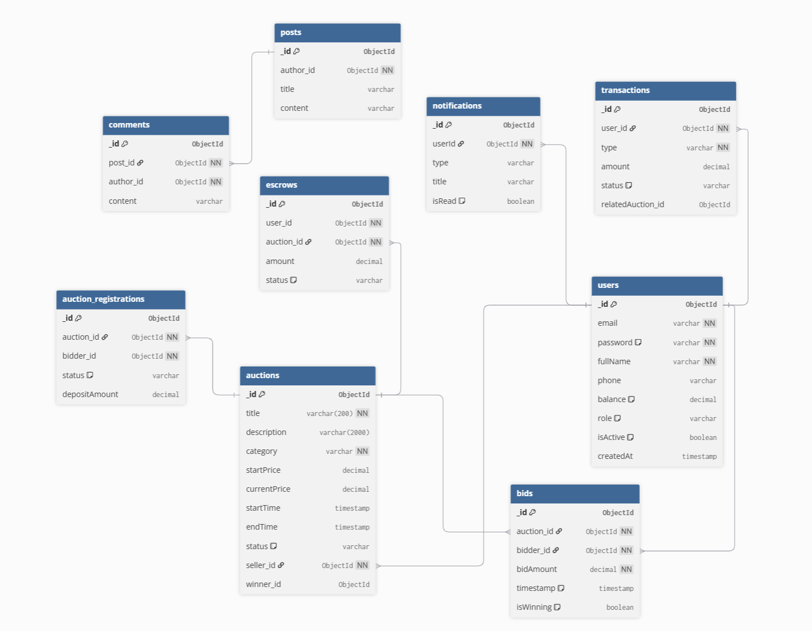

# Hệ Thống Đấu Giá Trực Tuyến Realtime

## Tổng quan

Hệ thống đấu giá trực tuyến sử dụng kiến trúc **Microservices**, xử lý đấu giá realtime với khả năng chống race condition khi nhiều người đặt giá đồng thời.

## Công nghệ sử dụng

**Backend**: Node.js, Express, MongoDB, Redis, Socket.io  
**Frontend**: React, Vite, Tailwind CSS  
**DevOps**: Docker, Docker Compose

## Cấu trúc dự án

```
ung-dung-phan-tan-web-auction/
├── frontend/                    # Ứng dụng Web React
├── services/                    # Các Microservices
│   ├── auth-service/           # Xác thực (Port 3001)
│   ├── auction-service/        # Quản lý đấu giá (Port 3002)
│   ├── bidding-service/        # Đấu giá Realtime (Port 3003)
│   ├── notification-service/   # Thông báo (Port 3004)
│   ├── payment-service/        # Ví & Thanh toán (Port 3006)
│   └── community-service/      # Bài viết & Bình luận (Port 3005)
├── shared/                      # Models và database dùng chung
│   ├── database/
│   └── models/                 
└── docker-compose.yml
```

## Sơ đồ ERD



**9 Bảng**: users, auctions, bids, auction_registrations, transactions, escrows, notifications, posts, comments

## Các chức năng đã hoàn thành

- Xác thực & JWT
- Quản lý đấu giá (CRUD) & vòng đời auction
- Đấu giá realtime với WebSocket
- Xử lý race condition (Redis locks)
- Đăng ký tham gia đấu giá với đặt cọc 10%
- Hệ thống ví & thanh toán
- Thông báo realtime (18 loại)
- Bài viết & bình luận cộng đồng

## Các chức năng chưa hoàn thành

- Xác thực email & đặt lại mật khẩu
- Tìm kiếm nâng cao & bộ lọc
- Tự động đấu giá
- Trang quản trị admin
- Nhiều phương thức thanh toán
- Phân tích & báo cáo

## Kế hoạch tương lai

### Tách riêng Database
Tách database riêng cho mỗi service với kiến trúc hướng sự kiện và Saga pattern

### Tính năng nâng cao
- **Dashboard realtime cho seller**: Thống kê đấu giá (lượt xem, lượt đặt giá, dự đoán doanh thu)
- **Phân tích cho bidder**: Tỷ lệ thắng/thua, theo dõi chi tiêu
- Gợi ý dựa trên AI
- Ứng dụng di động (React Native)

### Khả năng mở rộng
- Triển khai Kubernetes
- Tự động mở rộng & cân bằng tải
- Phân mảnh database & read replicas
- Giám sát (Prometheus, Grafana)

### Tính năng kinh doanh
- Nhiều loại đấu giá (silent, dutch, sealed-bid)
- Tính năng cao cấp & huy hiệu xác minh
- Tích hợp vận chuyển & thanh toán

## Khởi chạy

Xem chi tiết tại [QUICK_START.md](QUICK_START.md)

```bash
docker-compose up -d
```

**Frontend**: http://localhost:3000

## Tài liệu

- [QUICK_START.md](QUICK_START.md) - Hướng dẫn khởi động
- [STRUCTURE.md](STRUCTURE.md) - Cấu trúc chi tiết
- [RACE_CONDITION_EXPLAINED.md](RACE_CONDITION_EXPLAINED.md) - Xử lý race condition
- [PROJECT_FLOW_AND_ASSIGNMENT.md](PROJECT_FLOW_AND_ASSIGNMENT.md) - Flow người dùng và phân công công việc
